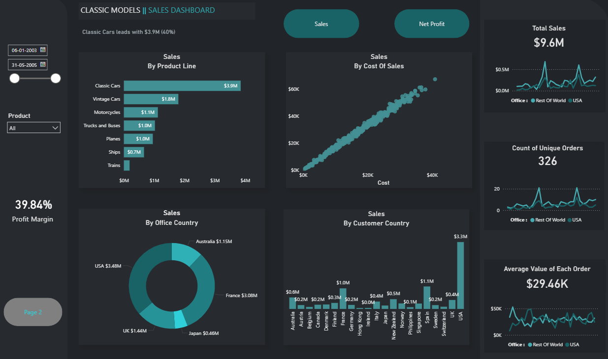
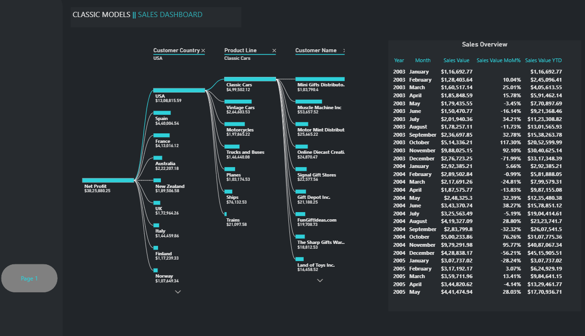
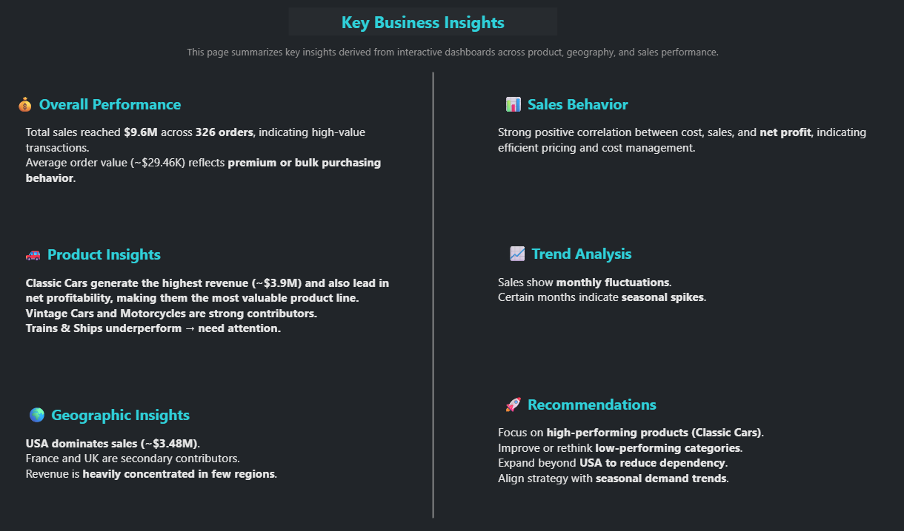

# 📊 Classic Models Sales Analysis

An end-to-end data analysis project using **MySQL and Power BI** to explore sales performance, customer behavior, and business insights from the Classic Models dataset.

---

## 📌 Project Overview

This project focuses on analyzing sales data by building a structured data model in MySQL and visualizing insights in Power BI.

* A SQL view (`fact_sales`) was created to consolidate transactional data
* Data was imported directly from MySQL into Power BI
* Data transformation and modeling were performed using Power Query
* Interactive dashboards were built to uncover insights and trends

---

## 🛠️ Tools & Technologies

* **MySQL** → Data extraction, joins, and view creation
* **Power BI** → Data transformation (Power Query), modeling, and visualization

---

## 🔄 Data Workflow

1. Created a **fact view (`fact_sales`)** in MySQL by joining:

   * Orders
   * Order Details
   * Customers
   * Products
   * Employees
   * Offices

2. Imported data into Power BI using MySQL connection

3. Performed:

   * Data cleaning
   * Column transformations
   * Calculated measures (Sales, Cost, Profit, etc.)

4. Built interactive dashboards for analysis

---

## 📈 Dashboard Preview

The dashboard is divided into three views: overview, detailed analysis, and business insights

### 🔹 Sales Dashboard Overview



---

### 🔹 Detailed Sales Analysis



---

### 🔹 Key Business Insights



---

## 📊 Key Metrics

* **Total Sales:** $9.6M
* **Total Orders:** 326
* **Average Order Value:** $29.46K
* **Profit Margin:** 39.84%

---

## 💡 Key Insights

### 🧾 Overall Performance

* High-value transactions indicate premium or bulk purchasing behavior
* Strong profit margin (~40%) reflects efficient pricing

### 🚗 Product Insights

* Classic Cars generate the highest revenue (~$3.9M) and profit
* Vintage Cars and Motorcycles are strong contributors
* Trains and Ships underperform and require attention

### 🌍 Geographic Insights

* USA dominates sales (~$3.48M)
* France and UK follow as secondary markets
* Revenue is concentrated in limited regions

### 📉 Sales Behavior

* Strong positive correlation between cost and sales
* Indicates consistent pricing and cost control

### 📅 Trend Analysis

* Monthly fluctuations observed
* Seasonal spikes suggest demand patterns

---

## 🚀 Recommendations

* Focus on high-performing products (Classic Cars)
* Optimize or rethink low-performing categories
* Expand beyond USA to reduce dependency
* Align inventory and marketing with seasonal trends

---

## 📂 Project Structure

```id="o9rr85"
classic-models-sales-analysis/
│
├── powerbi/
│   └── classic_models_sales_dashboard.pbix
│
├── images/
│   ├── 01_sales_dashboard_overview.png
│   ├── 02_sales_analysis_details.png
│   └── 03_business_insights_summary.png
│
├── sql/
│   └── fact_sales.sql
│
└── README.md
```

---

## 🎯 Conclusion

This project demonstrates how raw relational data can be transformed into actionable insights using SQL and Power BI.
It highlights the importance of combining data engineering and visualization to support business decision-making.

---
